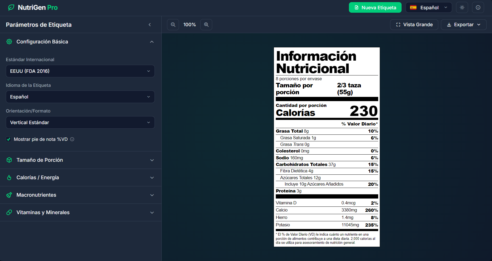

# NutriGen Pro - Generador de Etiquetas Nutricionales

NutriGen Pro es una herramienta web interactiva diseñada para la creación, visualización y exportación de etiquetas de información nutricional en tiempo real. Este proyecto nació como una solución personal a una necesidad específica durante un encargo de diseño de etiquetas de producto para un cliente, y se ha desarrollado con fines didácticos y prácticos.

> [!IMPORTANT]  
> **Aviso de Proyecto Amateur y Didáctico:**  
> Este es un proyecto desarrollado de forma amateur con fines de aprendizaje y uso personal, utilizando asistencia de Inteligencia Artificial. **No se garantiza la adhesión al 100% a ninguna legislación, normativa o regulación de etiquetado vigente (FDA, NOM-051, UE, etc.).** Los cálculos y redondeos pueden contener errores. Debe usarse únicamente como referencia creativa o didáctica y siempre bajo la supervisión de un profesional en regulaciones alimentarias.

## 🌟 Motivación del Proyecto

Este sitio fue creado porque necesitaba una herramienta ágil para generar estructuras de tablas nutricionales precisas para un proyecto de diseño gráfico. Al no encontrar una opción que me permitiera exportar vectores limpios y ajustar parámetros rápidamente, decidí construir esta solución. La comparto para cualquier otra persona que pueda encontrarla útil en sus propios flujos de trabajo de diseño o estudio.

## 🚀 Funcionalidades Principales

### 1. Estándares Internacionales (En desarrollo)

El sistema permite alternar entre diferentes normativas de etiquetado, adaptando automáticamente el formato y los nutrientes requeridos:

- **EEUU (FDA 2016):** Implementación de los formatos Vertical, Tabular/Horizontal y Lineal.
- **México (NOM-051):** Visualización de la tabla nutricional con sistema de sellos de advertencia octogonales.
- **Europa (Reg. 1169/2011):** Estructura basada en 100g/100ml (en desarrollo).

### 2. Personalización en Tiempo Real

- **Cálculo de % Valor Diario (%VD):** Basado en los valores de referencia de cada estándar.
- **Redondeo Legal:** Sistema de redondeo automático según las reglas de la FDA para calorías y nutrientes principales.
- **Configuración de Porciones:** Control total sobre las porciones por envase, unidades y pesos.
- **Vitaminas y Minerales:** Posibilidad de añadir nutrientes opcionales (Vitamina A, C, E, Calcio, Hierro, Potasio, etc.) en unidades de medida o porcentajes.

### 3. Herramientas de Exportación Profesional

- **JPG de Alta Resolución:** Exportación en diferentes escalas (hasta 5x) para uso en presentaciones o mockups.
- **Vectores SVG:** Descarga de archivos vectoriales para edición profesional en software como Adobe Illustrator, Figma o CorelDraw.
- **Vista Previa Expandida:** Modo de pantalla completa para inspección detallada de la etiqueta.

### 4. Interfaz y Experiencia de Usuario

- **Multilingüe:** Interfaz disponible en Español e Inglés.
- **Modo Oscuro/Claro:** Soporte nativo para temas visuales.
- **Diseño Responsivo (Desktop):** Optimizado para uso en estaciones de trabajo y pantallas de escritorio.
- **Validación Legislativa:** Panel informativo que alerta sobre posibles inconsistencias según la norma seleccionada.

## 🛠️ Tecnologías Utilizadas

- **HTML5 Semántico**
- **Vanilla CSS3** (Variables, Grid, Flexbox, Glassmorphism)
- **JavaScript (ES6+)**
- **Bibliotecas Externas:**
  - [Tabler Icons](https://tabler-icons.io/) para la iconografía.
  - [Flag Icons](https://github.com/lipis/flag-icons) para la selección de idiomas.
  - [html-to-image](https://github.com/bubkoo/html-to-image) para el procesamiento de exportaciones.

## 📄 Licencia

Este proyecto es libre para uso personal y educativo. Si decides utilizarlo para fines comerciales, recuerda que la responsabilidad de validar la información nutricional recae totalmente en el usuario final.

---

**Desarrollado por [firogv96](https://github.com/firogv96)**  
_Hecho con ❤️ y el soporte de IA para diseñadores y entusiastas del desarrollo web._
